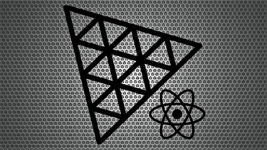
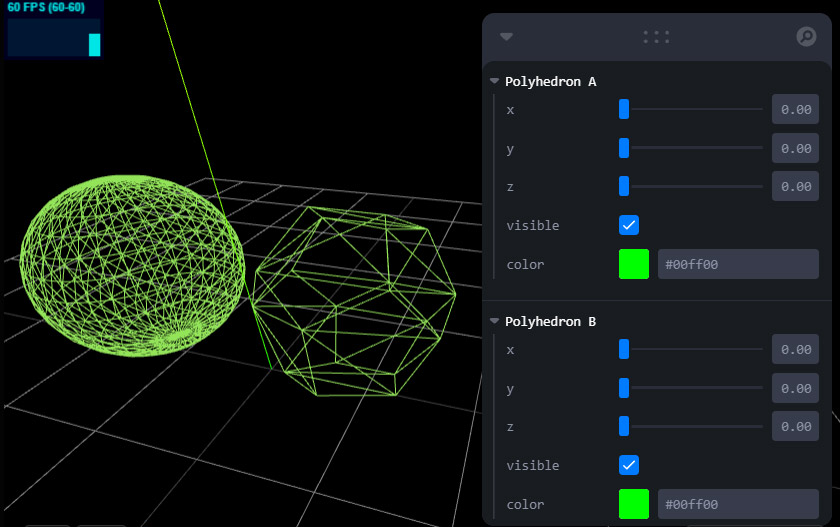
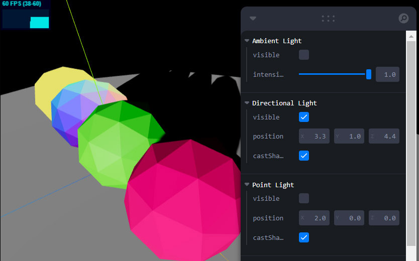
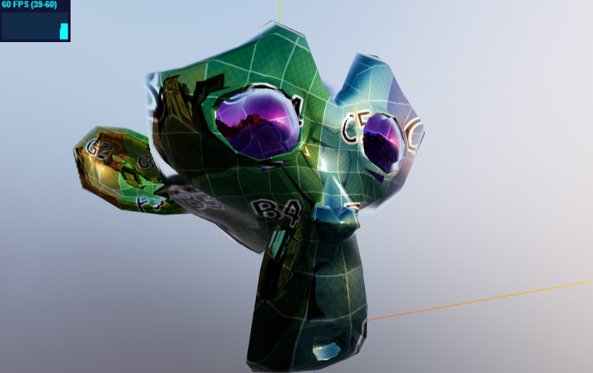
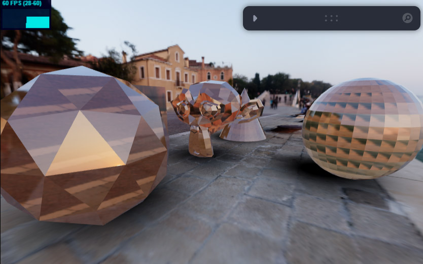
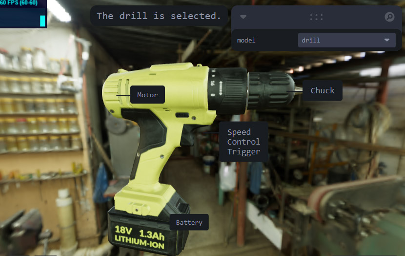
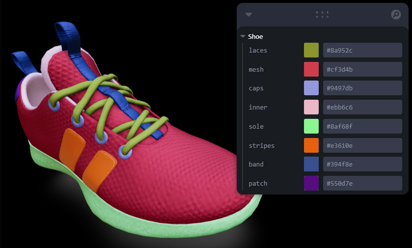
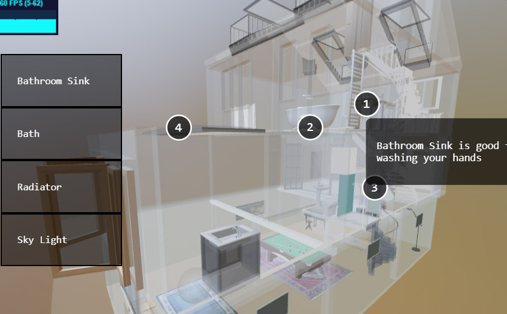
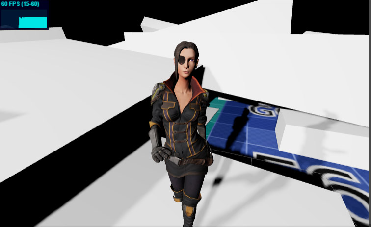

# React-Three-Fiber-Boilerplate

This boilerplate is supplemental to my React Three Fiber course documentation hosted at [https://sbcode.net/react-three-fiber/](https://sbcode.net/react-three-fiber/){target=\_blank}



## Install

```bash
git clone https://github.com/Sean-Bradley/React-Three-Fiber-Boilerplate.git
cd React-Three-Fiber-Boilerplate
npm install
npm start
```

Your default browser should open `http://localhost:3000/` automatically for you.

## Branches

There are many branches in this boilerplate demonstrating various aspects.

To list all branches type,

```bash
git branch
```

To install a specific branch, for example `orbitControls` type,

```bash
git checkout orbitControls
npm install
npm run start
```

and, you will get a quite interactive demo of some green wireframe cubes/spheres/dodecahedrons.

There are many branches.

Some other examples are,

### Leva Branch

```bash
git checkout leva
npm install
npm run start
```



### Shadows Branch

```bash
git checkout shadows
npm install
npm run start
```



### Environment Branch

```bash
git checkout environment
npm install
npm run start
```



### glTFAdvanced Branch

```bash
git checkout glTFAdvanced
npm install
npm run start
```



### Annotations Branch

```bash
git checkout annotations
npm install
npm run start
```



### GLTFJSX Branch

```bash
git checkout gltfjsx
npm install
npm run start
```



### House Branch

```bash
git checkout house
npm install
npm run start
```



### Follow Cam Branch

```bash
git checkout followCam
npm install
npm run start
```



## Other Branches

There are many branches in this boilerplate.

To list all branches type,

```bash
git branch
```

If you change to another branch, remember to first run

```bash
npm install
```

and then run.

```bash
npm start
```

## React Three Fiber Course

To allow me to continue to release free MIT code, please check out my React Three Fiber course on [Udemy](https://www.udemy.com/course/react-three-fiber/?referralCode=338F7F03D9775AD115A7) and [YouTube (Channel membership required)](https://www.youtube.com/playlist?list=PLKWUX7aMnlEK9DrrY1yXdiUBro1CryZaX).

[](https://youtu.be/5k395TH7ksE)

Thanks

Sean Bradley
